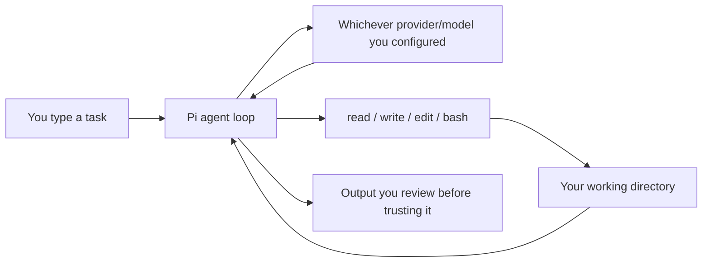
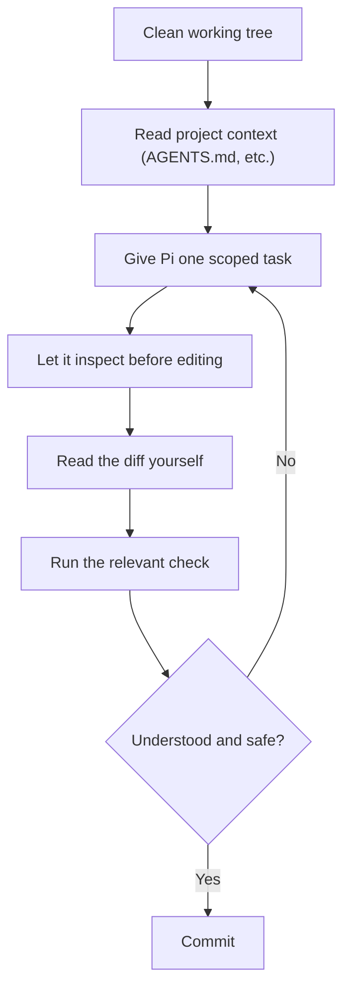

# pi-coding-agent-guide

A personal, crisp guide to installing and running the [`pi`](https://github.com/earendil-works/pi) coding-agent CLI: the default workflow first, configuration only where the defaults actually fall short.

Covers the install → use → configure progression end to end. Wording, scenarios, and code samples here are original; facts about `pi` itself (commands, flags, API shapes) are checked against the CLI's own docs.

Written against `pi` v0.84.1 (`@earendil-works/pi-coding-agent`). Pi ships fast — if a command below behaves differently, trust `pi --help` and the [upstream docs](https://github.com/earendil-works/pi/tree/main/packages/coding-agent/docs) over this guide.

## The mental model

Pi is the agent loop; whatever model/provider you configure does the actual reasoning. Swapping models never changes what tools Pi can call — swapping *providers* can change context limits, caching, and billing.



More on where this fits and where it doesn't: [Overview →](guide/01-overview.md)

## Quick start

```bash
npm install -g --ignore-scripts @earendil-works/pi-coding-agent
cd /path/to/your/project
pi
```

```text
/login
```

Then prove it understands the repo before letting it touch anything:

```text
Explain this repository's purpose, its main entry points, and the command
that runs its tests. Don't edit anything — just report back.
```

Full walkthrough, including the first small edit worth trying: [Install & Authenticate →](guide/02-install-and-auth.md), [Your First Session →](guide/03-first-session.md)

## The loop worth internalizing

Everything else — commands, project context, skills, extensions — exists to make one step of this loop faster or safer, not to replace it:



Full breakdown of why each step matters: [The Core Workflow →](guide/04-core-workflow.md)

## Read in order

1. [Overview](guide/01-overview.md) — the agent-loop-vs-provider mental model, when Pi fits
2. [Install & Authenticate](guide/02-install-and-auth.md) — npm install, `/login`, API keys
3. [Your First Session](guide/03-first-session.md) — a read-only probe, then a scoped edit
4. [The Core Workflow](guide/04-core-workflow.md) — the daily loop worth internalizing
5. [Commands & Sessions](guide/05-commands-and-sessions.md) — slash commands, `@`/`!`, session flags, non-interactive modes
6. [Project Context](guide/06-project-context.md) — `AGENTS.md`/`CLAUDE.md`, writing instructions the model can actually follow
7. [The Customization Ladder](guide/07-customization-ladder.md) — context file → prompt template → skill → extension → custom provider
8. [Skills & Extensions in Practice](guide/08-skills-and-extensions.md) — walkthroughs of two original examples
9. [Models, Cost & Security](guide/09-models-cost-security.md) — `/model`, custom endpoints, what the cost display can't tell you, the no-sandbox reality
10. [Uninstalling & Troubleshooting](guide/10-uninstall-and-troubleshooting.md) — reset cleanly, plus a checklist for common first-run snags

## Examples

- [`examples/AGENTS.example.md`](examples/AGENTS.example.md) — a project-instructions file for a small API service:

  ```markdown
  - Run `pytest -q` after any change under `app/`.
  - Migrations live in `alembic/versions/` — never hand-edit an existing one.
  - Ask before running `alembic upgrade` against a non-local database URL.
  ```

- [`examples/skills/test-gap-finder/SKILL.md`](examples/skills/test-gap-finder/SKILL.md) — a skill that flags untested branches in a diff
- [`examples/extensions/confirm-force-push.ts`](examples/extensions/confirm-force-push.ts) — a tiny extension that gates force-pushes behind a confirmation

## License

[MIT](LICENSE) &copy; Sumanth Hegde
