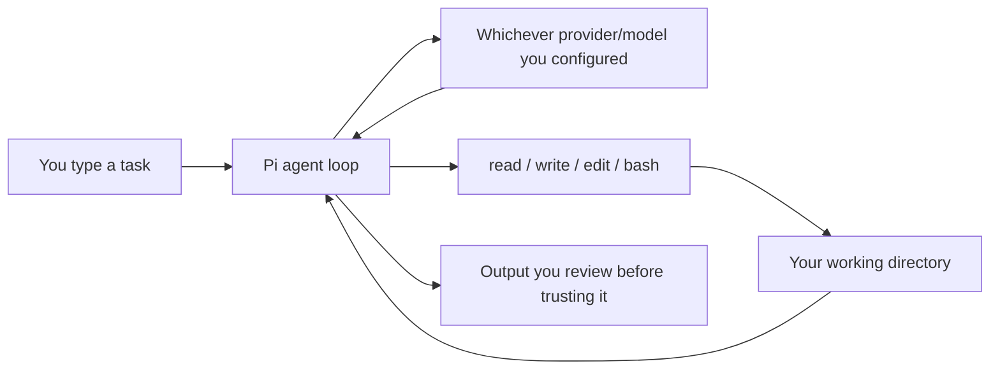

# 1. Overview

## Two separate things

`pi` is often talked about as if it *were* the model. It isn't. There are two layers, and keeping them separate saves a lot of confusion later:

- **The agent loop** — Pi itself: the terminal UI, the four core tools (`read`, `write`, `edit`, `bash`), session storage, and the extension/skill system that sits on top.
- **The model provider** — whoever actually answers the prompt: Anthropic, OpenAI, Google, a local llama.cpp server, or anything else Pi is configured to talk to.

Swapping the model (`/model`) never changes what tools Pi can call. Swapping the *provider* can change context limits, caching behavior, and how usage gets billed — those live on the provider's side, not Pi's.

## What Pi deliberately leaves out

Per its own [design principles](https://github.com/earendil-works/pi/blob/main/packages/coding-agent/docs/usage.md#design-principles), Pi does **not** ship built-in MCP support, sub-agents, permission prompts, plan mode, a to-do tracker, or background bash. Those are meant to be added as extensions or packages if and when you need them — not assumed on day one.

## Where it fits

| You want... | Pi fits | Pi is a weaker fit |
|---|---|---|
| A small, inspectable core you configure yourself | Yes | — |
| Every project to inherit the same permission model and integrations automatically | — | Look at a more managed, opinionated harness instead |
| To pick your own model/provider per project | Yes | — |
| Sandboxing or permission gating out of the box | No — see [security notes](09-models-cost-security.md#security-pi-has-no-built-in-sandbox) | — |

The rest of this guide follows one path: install, run it on a real task, learn the daily loop, then reach for configuration only once the defaults visibly aren't enough.

Next: [Install & Authenticate →](02-install-and-auth.md)
