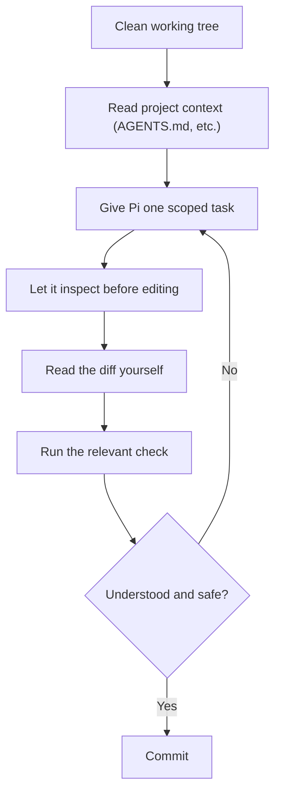

# 4. The Core Workflow

Models come and go — Pi will happily switch providers under you. What doesn't change is the loop you run every time you sit down with it:

A few notes on why each step matters, not just what it is:

- **Clean tree first.** If Pi's edit and your own uncommitted change land in the same diff, you can no longer tell which one introduced a problem.
- **One scoped task at a time.** A request like "clean up the auth module" invites the model to touch far more than you can review in one pass. "Extract the token-refresh logic in `auth/session.ts` into its own function, keep behavior identical" is reviewable.
- **Inspect before edit.** This isn't optional ceremony — a model that reads the wrong config file or guesses a command will edit confidently and wrongly. The read step is where that gets caught, if you check the report.
- **Read the diff, don't trust the summary.** Pi (like any agent) can describe a change accurately in prose while the actual diff does something slightly different — an off-by-one, a dropped edge case, a changed default.
- **Run something, not nothing.** "It looks right" isn't verification. Run the smallest test/lint/build command that would actually catch a regression in what changed.
- **Commit only what you understand.** If part of the diff surprises you, that part isn't ready to commit yet, independent of whether the rest is fine.

This loop is the part of using Pi that's worth actually internalizing. Everything else in this guide — commands, context files, skills, extensions — exists to make individual steps of this loop faster or more reliable, not to replace it.

Next: [Commands & Sessions →](05-commands-and-sessions.md)
