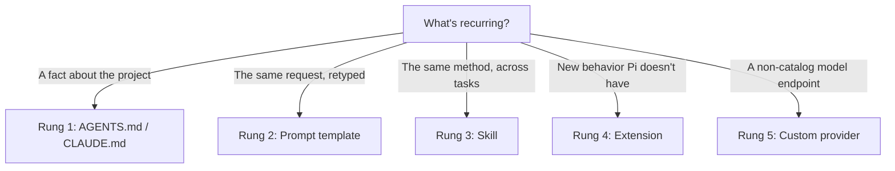

# 7. The Customization Ladder

The trap is installing a big extension/skill bundle before you've hit a real, repeated problem the defaults don't solve. Climb one rung at a time — each rung costs more to maintain than the one below it, so only go up when the rung below has genuinely stopped being enough.



| Rung | Mechanism | Reach for it when | Cost of maintaining it |
|---|---|---|---|
| 1 | `AGENTS.md` / `CLAUDE.md` | You keep re-explaining the same project fact | Low — it's a markdown file |
| 2 | Prompt template (`.pi/prompts/*.md` or `~/.pi/agent/prompts/`) | You keep retyping the same *request* | Low — one file, no logic |
| 3 | Skill (`SKILL.md` + optional scripts) | You keep re-explaining the same *method* across many tasks | Medium — instructions the model loads conditionally |
| 4 | Extension (TypeScript, hooks/commands/tools) | You need new *behavior* Pi doesn't have — blocking a tool call, adding a command | High — real code with your full user permissions |
| 5 | Custom provider (`models.json`) | You're pointing at a non-catalog endpoint — a local server, an internal proxy | Medium — one config file, but you own correctness of the schema |

### Rung 2 in practice — prompt templates

A prompt template is just a markdown file that expands into a full request when you type `/name`:

```markdown
---
description: Review staged changes for correctness and safety
---
Review the staged changes (`git diff --cached`). Call out logic errors,
missing error handling, and anything that touches auth or payments.
```

Save that as `.pi/prompts/review.md` and `/review` expands it. No code, no conditional loading — just a shortcut for a request you'd otherwise retype.

### Rungs 3 and 4 — skills and extensions

These get their own chapter with runnable examples: [Skills & Extensions in Practice](08-skills-and-extensions.md).

### Rung 5 — a custom model endpoint

Only needed for something outside Pi's built-in catalogs — a self-hosted OpenAI-compatible server, for instance. `/model` already covers everything in the live catalog; don't reach for `~/.pi/agent/models.json` until you're pointing somewhere the catalog doesn't know about. The [custom models doc](https://github.com/earendil-works/pi/blob/main/packages/coding-agent/docs/models.md) has the full schema — it varies by API shape (OpenAI Completions vs. Responses vs. Anthropic Messages), so don't assume one endpoint's config transfers to another.

Next: [Skills & Extensions in Practice →](08-skills-and-extensions.md)
